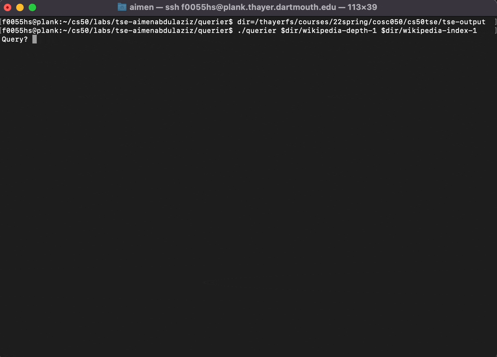

# CS50 Spring 2022, Tiny Search Engine
## Aimen Abdulaziz

This repository consists of a search engine that crawls webpages, indexes the contents of the pages, and processes user queries to return all relevant pages in ranked order akin to Google Search. 


    
### Code Organizations

The Tiny Search Engine consists of three major components: `crawler`, `indexer`, and `querier`. The `common` directory contains common modules shared by the three components. This repository has the following files:
```bash
├── common
│   ├── common.a
│   ├── index.c
│   ├── index.h
│   ├── Makefile
│   ├── pagedir.c
│   ├── pagedir.h
│   ├── README.md
│   ├── word.c
│   └── word.h
├── crawler
│   ├── crawler.c
│   ├── DESIGN.md
│   ├── IMPLEMENTATION.md
│   ├── Makefile
│   ├── README.md
│   ├── REQUIREMENTS.md
│   ├── testing.out
│   └── testing.sh
├── indexer
│   ├── DESIGN.md
│   ├── IMPLEMENTATION.md
│   ├── indexer.c
│   ├── indextest.c
│   ├── Makefile
│   ├── README.md
│   ├── REQUIREMENTS.md
│   ├── testing.out
│   └── testing.sh
├── libcs50
│   ├── bag.c
│   ├── bag.h
│   ├── counters.h
│   ├── file.c
│   ├── file.h
│   ├── file.md
│   ├── hashtable.h
│   ├── jhash.c
│   ├── jhash.h
│   ├── libcs50-given.a
│   ├── Makefile
│   ├── memory.c
│   ├── memory.h
│   ├── memory.md
│   ├── README.md
│   ├── set.h
│   ├── webpage.c
│   ├── webpage.h
│   └── webpage.md
├── Makefile
├── querier
│   ├── DESIGN.md
│   ├── fuzzquery.c
│   ├── IMPLEMENTATION.md
│   ├── Makefile
│   ├── querier.c
│   ├── queries.test
│   ├── README.md
│   ├── REQUIREMENTS.md
│   ├── testing.out
│   └── testing.sh
└── README.md
```

### Usage 
To build all components of the Tiny Search Engine, run `make`.

To check memory link in each component, run `make valgrind`

To clean up, run `make clean`.

For more information, please refer to the READMEs in each directory. 

### Documentation
The three major components of the Tiny Search Engine are thoroughly documented. 
- REQUIREMENT: specifies what the program must do
- DESIGN: specifies the structure of the program in a language-independent, machine-dependent way
- IMPLEMENTATION: specifies the language-dependent, machine-dependent details of the implementation. It includes detailed pseudocode, API definition, function prototypes, resource management, and error handling.
- README

### Limitation
This implementation of Tiny Search Engine only works in the CS50 playground: `http://cs50tse.cs.dartmouth.edu/`. This is because the `webpage` module blocks external websites.
